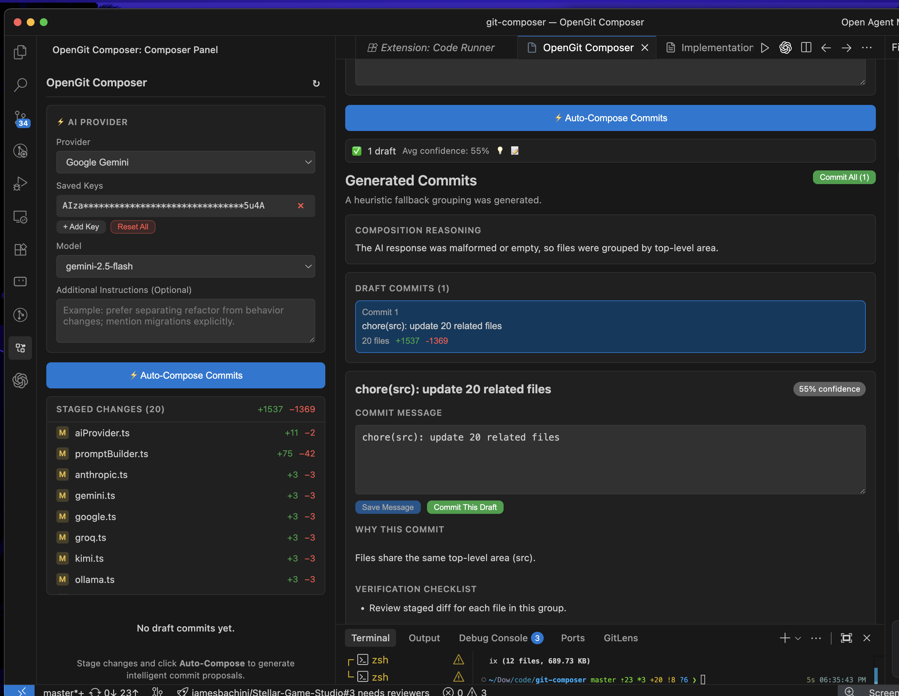

<div align="center">
  
  
  <h1>OpenGit Composer</h1>
  
  <p><strong>AI-powered Git commit composer. Turn chaotic multi-file diffs into clean, atomic, reviewable commits.</strong></p>

  <p>
    <a href="https://opengit.shikhar.xyz/">
      
    </a>
    <a href="https://marketplace.visualstudio.com/items?itemName=0xshikhar.opengit-composer">
      
    </a>
    <a href="https://open-vsx.org/extension/0xshikhar/opengit-composer">
      
    </a>
    <a href="https://github.com/0xshikhar/opengit-composer/releases">
      
    </a>
    <a href="https://github.com/0xshikhar/opengit-composer/blob/main/LICENSE">
      
    </a>
  </p>

  <p>
    
    
  </p>
</div>

---

## ⚡ Overview

Stop creating messy monolithic commits like `git commit -m "fix stuff and updates"`. 

**OpenGit Composer** analyzes your staged changes, understands the intent across multi-file diffs, intelligently groups related changes into **logical atomic commits**, and drafts high-quality commit messages with rationale.

Bring your own API keys for top cloud models (**OpenAI, Anthropic Claude, Google Gemini, Groq, Kimi**), or run **100% offline & free** using local models with **Ollama** or **LM Studio**.

<p align="center">
  
</p>

---

## 💡 The Problem vs The OpenGit Solution

| Without OpenGit Composer ❌ | With OpenGit Composer ⚡ |
| --- | --- |
| 15 modified files squashed into one massive, unreviewable commit | Staged diffs automatically decomposed into isolated, atomic commits |
| Vague messages (`git commit -m "updates"`) that ruin `git blame` | Clear, semantic messages (`feat(auth): ...`, `fix(ui): ...`) with reasoning |
| Tedious manual staging (`git add -p`) line by line | One-click auto-composition with full review and batch commit |
| Sending secrets to the cloud unknowingly | Pre-flight regex redaction and glob exclusions protect your credentials |
| Locked into a single proprietary LLM | Multi-provider freedom: Claude, GPT-4o, Gemini, Groq, Ollama, LM Studio |

---

## ✨ Key Features

### 🧠 1. Intelligent Semantic Diff Splitting
Got 20 modified files spanning backend models, UI tweaks, test suites, and docs? OpenGit Composer understands code semantics and clusters related file changes into separate, focused commit proposals.

### 🌐 2. Multi-Provider Freedom (Cloud + Local)
Never get vendor-locked:
- **Cloud Providers**: OpenAI (GPT-4o, o3-mini), Anthropic (Claude 3.7 & 3.5 Sonnet), Google Gemini (Gemini 2.5 Flash / Pro), Groq (sub-second Llama 3), and Moonshot / Kimi.
- **Local & Offline Inference**: Native first-class support for **Ollama** and **LM Studio** (`localhost`). Your code never leaves your workstation.
- **Custom Endpoints**: Connect to any OpenAI-compatible server (vLLM, llama.cpp, TurboFieldfare).
- **Multi-Key Pooling**: Add multiple API keys with automatic pooling and fallback handling.

### 🛡️ 3. Privacy-First by Design & Secret Redaction
- **On-the-Fly Regex Redaction**: Automatically strip API keys, JWTs, passwords, and sensitive strings *before* diffs are sent to an LLM.
- **File Exclusion Globs**: Ignore `.env*`, `*.pem`, proprietary files, or lockfiles from ever reaching the prompt.
- **Zero Telemetry**: No third-party tracking, no intermediate proxy servers, and zero data collection.

### 📝 4. Team-Friendly Commit Standards
Generate commits formatted according to your team's exact style guide:
- **Conventional Commits** (`feat(scope): ...`, `fix: ...`, `chore: ...`)
- **Angular Convention**
- **Gitmoji** (`✨ feat: ...`, `🐛 fix: ...`, `♻️ refactor: ...`)
- **Custom Template** (configure your own prefixes, length constraints, and breaking change notations)

### 🖥️ 5. Interactive Diff & Draft Studio
- **Integrated Monaco Diff Viewer**: Inspect file changes side-by-side or inline directly within VS Code.
- **Full Control Draft Editor**: Tweak generated titles, edit commit bodies, reassign files, or regenerate individual drafts before writing to git history.
- **Batch or Selective Commits**: Commit drafts individually with one click or execute all planned commits in order.

---

## 🚀 Quick Start

### 1. Installation

**From VS Code Marketplace:**
Search for **OpenGit Composer** in the VS Code Extensions view (`Ctrl+Shift+X` / `Cmd+Shift+X`), or run:
```bash
code --install-extension 0xshikhar.opengit-composer
```

**From Open VSX:**
Available on [Open VSX](https://open-vsx.org/extension/0xshikhar/opengit-composer) for VSCodium and Cursor.

### 2. Basic Workflow

1. **Stage your changes** in Git as you normally do (`git add .` or via the VS Code Source Control panel).
2. Open **OpenGit Composer** from the Activity Bar icon.
3. Configure your provider (⚙ Settings icon):
   - Choose **Cloud** (OpenAI, Claude, Gemini, Groq, Kimi) and paste your API key, **or**
   - Choose **Local** (Ollama / LM Studio) for 100% private, free offline inference.
4. Click **⚡ Auto-Compose Commits** (or press `Cmd+Shift+P` -> `OpenGit Composer: Auto-Compose Semantic Commits`).
5. Review the proposed atomic commits, fine-tune messages if desired, and click **Commit All**!

---

## 🤖 Supported Providers

| Provider | Type | Recommended Models | Setup Requirements | Privacy Level |
| --- | --- | --- | --- | --- |
| **Ollama** | Local | `qwen2.5-coder`, `llama3.3`, `mistral` | Run `ollama serve` on localhost | 🔒 100% Offline |
| **LM Studio** | Local | `deepseek-coder`, `qwen2.5-coder` | Start LM Studio Local Server | 🔒 100% Offline |
| **Anthropic** | Cloud | `claude-3-7-sonnet`, `claude-3-5-sonnet` | Anthropic API Key | ☁️ Direct to Anthropic API |
| **OpenAI** | Cloud | `gpt-4o`, `o3-mini`, `gpt-4o-mini` | OpenAI API Key | ☁️ Direct to OpenAI API |
| **Google Gemini** | Cloud | `gemini-2.5-flash`, `gemini-2.5-pro` | Google AI Studio Key | ☁️ Direct to Google API |
| **Groq** | Cloud | `llama-3.3-70b-versatile` | Groq API Key | ☁️ Direct to Groq API |
| **Kimi (Moonshot)** | Cloud | `moonshot-v1-8k`, `moonshot-v1-32k` | Moonshot API Key | ☁️ Direct to Moonshot API |

---

## ⚙️ Configuration & Settings

Configure OpenGit Composer via VS Code Settings (`Cmd+,` / `Ctrl+,` and search for `commitComposer`):

| Setting | Default | Description |
| --- | --- | --- |
| `commitComposer.aiProvider` | `"openai"` | AI provider (`openai`, `anthropic`, `gemini`, `groq`, `lmstudio`, `kimi`, `ollama`) |
| `commitComposer.apiKey` | `""` | API key for the selected cloud provider |
| `commitComposer.model` | `""` | Model identifier (leave empty for provider default) |
| `commitComposer.ollamaHost` | `"http://localhost:11434"` | URL for local Ollama server |
| `commitComposer.lmStudioHost` | `"http://localhost:1234/v1"` | URL for local LM Studio OpenAI-compatible endpoint |
| `commitComposer.commitFormat` | `"conventional"` | Commit style: `conventional`, `angular`, `gitmoji`, or `custom` |
| `commitComposer.maxSubjectLength`| `72` | Maximum character length for commit subject lines |
| `commitComposer.splitThreshold` | `3` | File count threshold above which diffs are decomposed into multiple commits |
| `commitComposer.excludePatterns` | `[]` | Glob patterns excluded from AI input (e.g. `["*.env*", "**/secrets/**"]`) |
| `commitComposer.redactPatterns` | `[]` | Regex patterns redacted from diff text before sending to LLM |
| `commitComposer.debugMode` | `false` | Enables verbose diagnostic output in the Output channel |

---

## ⌨️ Command Palette Commands

Access these commands at any time via `Cmd+Shift+P` (macOS) or `Ctrl+Shift+P` (Windows/Linux):

- `OpenGit Composer: Auto-Compose Semantic Commits` — Open composer and start analyzing staged changes.
- `OpenGit Composer: Show Debug Logs` — View diagnostics and AI request/response logs.
- `OpenGit Composer: Copy Sanitized Logs` — Copy sanitized logs (keys stripped) for troubleshooting.

---

## 🔒 Privacy & Security Guarantee

- **Your code stays yours**: Diffs are only sent to the provider you explicitly select. When using Ollama or LM Studio, diffs never leave your local machine.
- **Keys stored securely**: API keys are saved in VS Code's secure secret storage and never synchronized to remote telemetry.
- **Zero analytics**: OpenGit Composer collects no usage data, tracking pixels, or diagnostic telemetry.

---

## 🤝 Support & Links

- **Official Product Website**: [opengit.shikhar.xyz](https://opengit.shikhar.xyz/)
- **Bug Reports & Feature Requests**: [GitHub Issues](https://github.com/0xshikhar/opengit-composer/issues)
- **Source Code Repository**: [github.com/0xshikhar/opengit-composer](https://github.com/0xshikhar/opengit-composer)

<div align="center">
  <p><em>Crafted for developers who care about clean, meaningful git history.</em></p>
</div>

